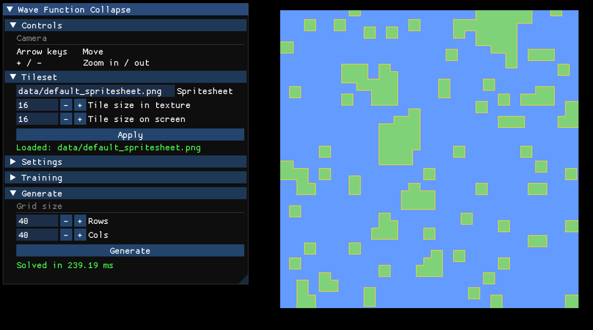

# Wave Function Collapse - Procedural Tile Map Generator

A C++ application that uses the **Wave Function Collapse (WFC)** algorithm to procedurally generate 2D tile maps. Built with [raylib](https://www.raylib.com/) for rendering and [Dear ImGui](https://github.com/ocornut/imgui) for the debug interface.



---

## Features

- Procedural tile map generation using the WFC algorithm
- Interactive debug UI for controlling every aspect of the pipeline
- **Trainer** - learns adjacency rules and tile weights by analysing sample tilemap images
- **Settings I/O** - save and load learned rules to/from JSON so you don't have to re-train every run
- Configurable grid size, spritesheet, and tile dimensions at runtime
- Pan and zoom camera to explore generated maps

---

## How It Works

### Wave Function Collapse

WFC is a constraint-satisfaction algorithm that generates a grid of tiles by repeatedly making small, locally-consistent decisions until the whole grid is filled.

Every cell in the grid starts out in a *superposition* - it could be any tile. The algorithm then works through three repeating steps:

1. **Observe** - pick the cell with the lowest *Shannon entropy* (fewest valid tile options remaining). Ties are broken randomly.
2. **Collapse** - randomly choose one tile for that cell, weighted by how often each tile appeared in the training data.
3. **Propagate** - ripple the consequence of that choice outward. Any neighbouring cell that now has a tile option that would violate an adjacency rule has that option removed. If a neighbour's options change, its neighbours are checked too, and so on.

Steps 1-3 repeat until every cell has been collapsed to a single tile. If propagation ever empties a cell's option list entirely, the algorithm returns failure and the caller can retry from scratch.

### Adjacency Rules

Rules encode which tiles are allowed to sit next to each other and in which direction. A rule `(tile A, direction Right, tile B)` means "tile A is allowed to have tile B immediately to its right." Rules are directional - having B to the right of A does not automatically permit A to the right of B.

Rules can either be set manually or learned automatically by the **Trainer**, which scans a sample tilemap image and records every pair of adjacent tiles it finds.

### Shannon Entropy

Rather than picking cells to collapse at random, the algorithm always picks the cell with the lowest Shannon entropy:

```
H = log(Σw) - (Σ w·log(w)) / Σw
```

where `w` is the weight of each remaining candidate tile. This prioritises the most constrained cells, which tends to produce more coherent results and reduces the chance of running into a contradiction later.

### Min-Heap with Lazy Deletion

Entropy values change constantly as propagation removes tile options from cells. Rather than rebuilding a sorted structure from scratch after each change, the implementation uses a **min-heap with lazy deletion**. When a cell's entropy changes, a new entry is pushed onto the heap. Stale entries (superseded by a newer one for the same cell) are skipped when they reach the top of the heap using a version-counter pair (`m_HeapVersion` / `m_CellVersion`). This keeps the observation step fast without expensive heap updates.

---

## Algorithmic Complexity

The time complexity was empirically measured by running the solver on grids from 10×10 up to 200×200 (5 runs each, averaged) and fitting the results.

The observed growth is approximately **O(n² log n)**, where n is the side length of the grid (so the total cell count is n²).

This is consistent with what you'd expect from the algorithm's structure:
- Each of the **n²** cells is collapsed and propagated once.
- Propagation itself visits neighbours in a breadth-first manner - in the worst case touching O(n²) cells per collapse, but in practice far fewer due to early termination.
- Each heap operation costs **O(log n²) = O(log n)**.

---

## Project Structure

```
├── app/
│   ├── app.h / app.cpp          — Application entry point and ImGui debug UI
│   ├── camera.h / camera.cpp    — Pan/zoom camera
│   └── grid_renderer.h / .cpp   — Renders the tile grid using a spritesheet
├── wfc/
│   ├── array2d.h                — Generic 2D array container
│   ├── grid.h / grid.cpp        — Stores the collapsed tile grid
│   ├── wfc_solver.h / .cpp      — Core WFC algorithm
│   ├── wfc_trainer.h / .cpp     — Learns rules from sample tilemap images
│   └── wfc_settings_io.h / .cpp — JSON save/load for WFC_Settings
├── debug_utils.h                — Coloured console logging helpers
└── main.cpp
```

---

## Debug UI

The ImGui panel (top-left corner) exposes the full pipeline:

| Section | What it does |
|---|---|
| **Controls** | Lists the camera keyboard shortcuts |
| **Tileset** | Set the spritesheet path, tile pixel size, and on-screen tile size. Apply reloads the texture. |
| **Settings** | Load a `.json` file containing pre-saved adjacency rules and tile weights. |
| **Training** | Add sample tilemap images, run the trainer, and optionally save the resulting settings to a `.json` file. |
| **Generate** | Set grid dimensions and click Generate to run the solver. |

### Camera Controls

| Input | Action |
|---|---|
| Arrow keys | Pan |
| `+` / `-` | Zoom in / out |

---

## Settings JSON Format

Settings files produced by the trainer (or written by hand) follow this schema:

```json
{
    "tileIds": [0, 1, 2, 3],
    "tileWeights": {
        "0": 12.0,
        "3": 5.0
    },
    "adjacencyRules": [
        { "tile": 0, "direction": 0, "neighbour": 1 },
        { "tile": 0, "direction": 1, "neighbour": 2 }
    ]
}
```

Direction encoding: `0` = Up, `1` = Right, `2` = Down, `3` = Left.

Tiles absent from `tileWeights` default to a weight of `1.0`.

---

## Dependencies

| Library | Purpose |
|---|---|
| [raylib](https://www.raylib.com/) | Window, input, texture rendering |
| [Dear ImGui](https://github.com/ocornut/imgui) | Debug UI |
| [rlImGui](https://github.com/raylib-extras/rlImGui) | raylib + ImGui integration |
| [nlohmann/json](https://github.com/nlohmann/json) | JSON serialisation (single header) |

---

## Sources

- https://github.com/mxgmn/WaveFunctionCollapse
- https://www.youtube.com/watch?v=qRtrj6Pua2A
- https://robertheaton.com/2018/12/17/wavefunction-collapse-algorithm/
- https://www.boristhebrave.com/2020/04/13/wave-function-collapse-explained/
